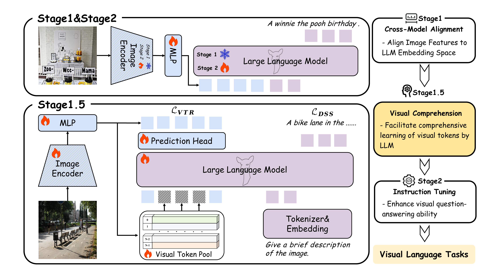

# ViCToR: Improving Visual Comprehension via Token Reconstruction for Pretraining LMMs


[](https://arxiv.org/abs/2410.14332) [](https://huggingface.co/collections/DeepGlint-AI/croc-670d1a34f0ad3dc15144585b)

<p align="center">
  
</p>


Large Multimodal Models (LMMs) often face a modality representation gap during pretraining: while language embeddings remain stable, visual representations are highly sensitive to contextual noise (e.g., background clutter). To address this issue, we introduce a visual comprehension stage, which we call **ViCToR** (**Vi**sual **C**omprehension via **To**ken **R**econstruction), a novel pretraining framework for LMMs. ViCToR employs a learnable visual token pool and utilizes the Hungarian matching algorithm to select semantically relevant tokens from this pool for visual token replacement. Furthermore, by integrating a visual token reconstruction loss with dense semantic supervision, ViCToR can learn tokens which retain high visual detail, thereby enhancing the large language model’s (LLM’s) understanding of visual information.

After pretraining on 3 million publicly accessible images and captions, **ViCToR** achieves state-of-the-art results, improving over LLaVA-NeXT-8B by 10.4%, 3.2%, and 7.2% on the MMStar, SEED_I, and RealWorldQA benchmarks, respectively. We will release the code and model weights to facilitate reproducibility.

## 📜 News
**[2024/10/21]** The [paper](https://arxiv.org/pdf/2410.14332) and [code](https://github.com/deepglint/Croc) are released!💥

## 👨‍💻 Todo
- [ ] Better model base on ViCToR
- [x] Checkpoints of ViCToR-7B
- [x] Training code for ViCToR

## 🤖 Model Zoo

| Benchmark          | ViCTOR-7B | LLaVA-1.5-13B | LLaVA-NeXT-8B | Ross   |
|--------------------|-----------|---------------|---------------|--------|
| MMStar             | **54.3**  | 34.3          | 43.9          | 53.9   |
| RealWorldQA        | **65.6**  | 55.3          | 58.4          | 58.7   |
| MMBench^(cn,val)   | **79.0**  | 67.8          | –             | –      |
| OCRBench           | 556       | 337           | 531           | 553    |
| POPE               | 88.4      | 88.4          | 87.1          | 88.1   |
| MMU                | 48.9      | 37.0          | 43.1          | 49.0   |
| A12D               | 79.5      | 61.1          | 72.8          | 79.5   |
| MME                | 2071      | 1781          | 1908          | 1854   |
| SEED^(f)           | **75.7**  | 68.2          | 72.5          | 73.6   |

## 📊 Visualization
<p align="center">
  
</p>
<p align="center">
  
</p>
<p align="center">
  
</p>


## Install

```bash
git clone https://github.com/deepglint/Victor.git
cd Victor
conda create -n victor python=3.10 -y
conda activate victor

pip install --upgrade pip
pip install -e .
pip install flash-attn --no-build-isolation
```

## Training

**Stage 1: Pretraining MLP**
```bash
bash scripts/pretrain_mlp.sh
```

**Stage 1.5: Pretraining ViCToR**
```bash
bash scripts/pretrain_victor.sh
```

**Stage 2: Instructional Finetuning**
```bash
bash scripts/finetune.sh
```

---


## Citation

```latex
@misc{xie2024crocpretraininglargemultimodal,
      title={ViCToR: Improving Visual Comprehension via Token Reconstruction for Pretraining LMMs}, 
      author={Yin Xie and Kaicheng Yang and Peirou Liang and Xiang An and Yongle Zhao and Yumeng Wang and Ziyong Feng and Roy Miles and Ismail Elezi and Jiankang Deng},
      year={2024},
      eprint={2410.14332},
      archivePrefix={arXiv},
      primaryClass={cs.CV},
      url={https://arxiv.org/abs/2410.14332}, 
}
```

## Acknowledgement  

We extend our deepest gratitude to the creators and contributors of the following projects:  
1. [LLaVA](https://github.com/haotian-liu/LLaVA): The comprehensive codebase for training Vision-Language Models (VLMs).  

Their exceptional work has been instrumental to our research and development efforts.
